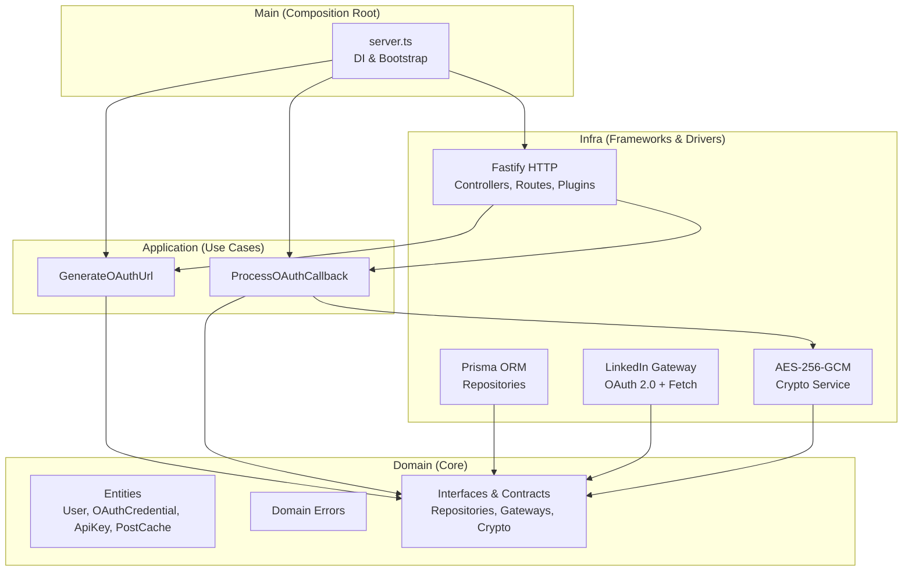

# 🌉 LinkedBridge

**Ponte segura entre o LinkedIn e sites de portfólio pessoais.**

LinkedBridge é um SaaS que permite que criadores de conteúdo exibam automaticamente seus posts do LinkedIn em seus sites de portfólio, sem expor credenciais ou dados sensíveis.

---

## 📐 Arquitetura

O projeto segue **Clean Architecture**, isolando regras de negócio de frameworks e serviços externos:



**Dependência flui de fora para dentro** — o Domínio nunca importa Fastify, Prisma ou qualquer framework.

---

## 🚀 Instalação

### Pré-requisitos

- **Node.js** >= 20.0.0
- **PostgreSQL** (Supabase ou local)
- Conta de desenvolvedor no [LinkedIn](https://www.linkedin.com/developers/)

### Setup

```bash
# 1. Clone o repositório
git clone https://github.com/davydsonmr1/socialmedia-service.git
cd socialmedia-service

# 2. Instale as dependências
npm install

# 3. Configure as variáveis de ambiente
cp .env.example .env
# Edite o .env com suas credenciais

# 4. Gere a chave de criptografia (AES-256-GCM)
node -e "console.log(require('crypto').randomBytes(32).toString('base64'))"
# Cole o resultado em ENCRYPTION_MASTER_KEY no .env

# 5. Gere o Prisma Client
npx prisma generate

# 6. Execute as migrações
npx prisma migrate dev

# 7. Inicie o servidor
npm run dev
```

---

## 🔒 Security Features

### 1. Criptografia AES-256-GCM (Tokens OAuth)

Os access tokens do LinkedIn são **criptografados antes de tocar o banco de dados**. Usamos AES-256-GCM (authenticated encryption) com:

| Componente | Propósito |
|---|---|
| `encryptedAccessToken` | Ciphertext do token |
| `iv` (Initialization Vector) | Único por operação (16 bytes aleatórios) |
| `authTag` | Prova de integridade (anti-tampering) |

A chave mestra (`ENCRYPTION_MASTER_KEY`) existe **apenas em variáveis de ambiente**, nunca no banco.

### 2. Isolamento de Dados (Blast Radius Reduction)

Credenciais OAuth são armazenadas em tabela separada (`oauth_credentials`), não na tabela de usuários. Uma brecha na tabela `users` **não expõe tokens criptografados**.

### 3. API Keys com Hash-Only Storage

As chaves de API para portfólios são armazenadas **apenas como SHA-256 hash**. O valor original é mostrado ao usuário uma única vez e nunca persiste.

### 4. Cookies HttpOnly + CSRF Protection

O fluxo OAuth usa cookies `__Host-` prefixados com:
- `httpOnly: true` — inacessível via JavaScript (XSS mitigation)
- `secure: true` — apenas HTTPS
- `sameSite: 'lax'` — proteção contra CSRF
- `maxAge: 300` — expira em 5 minutos

O parâmetro `state` é um token CSPRNG de 128 bits validado no callback.

### 5. Global Error Handler

Erros internos (SQL, Node.js exceptions) **nunca são expostos ao cliente**. O error handler:
- Mapeia `DomainError` → HTTP status code correto
- Erros desconhecidos → `500 Internal Server Error` genérico
- Stack traces → apenas nos logs internos

### 6. HTTP Security Headers (Helmet)

- `Strict-Transport-Security` (HSTS com preload)
- `Content-Security-Policy`
- `X-Content-Type-Options: nosniff`
- `X-Frame-Options: DENY`
- `Referrer-Policy`

### 7. Rate Limiting

100 requisições por minuto por IP — proteção contra brute-force e DDoS básico.

---

## 📂 Estrutura do Projeto

```
src/
├── domain/           # Regras de negócio puras (zero imports de frameworks)
│   ├── entities/     # User, OAuthCredential, PortfolioApiKey, PostCache
│   ├── errors/       # DomainError, UnauthorizedError, GatewayError...
│   ├── gateways/     # ILinkedInGateway interface
│   ├── interfaces/   # ICryptoService interface
│   └── repositories/ # IUserRepository, IOAuthCredentialRepository...
├── application/      # Casos de Uso (orquestração)
│   ├── dtos/         # Data Transfer Objects
│   └── use-cases/    # GenerateOAuthUrl, ProcessOAuthCallback
├── infra/            # Implementações concretas
│   ├── crypto/       # AesGcmCryptoService
│   ├── database/     # Prisma repositories (Task 7)
│   ├── gateways/     # LinkedInGateway (fetch + Zod validation)
│   └── http/         # Fastify app, controllers, routes, error-handler
└── main/             # Composition Root (server.ts)
```

---

## 🧪 Testes

```bash
npm test
```

---

## 📝 Licença

Projeto privado — todos os direitos reservados.
